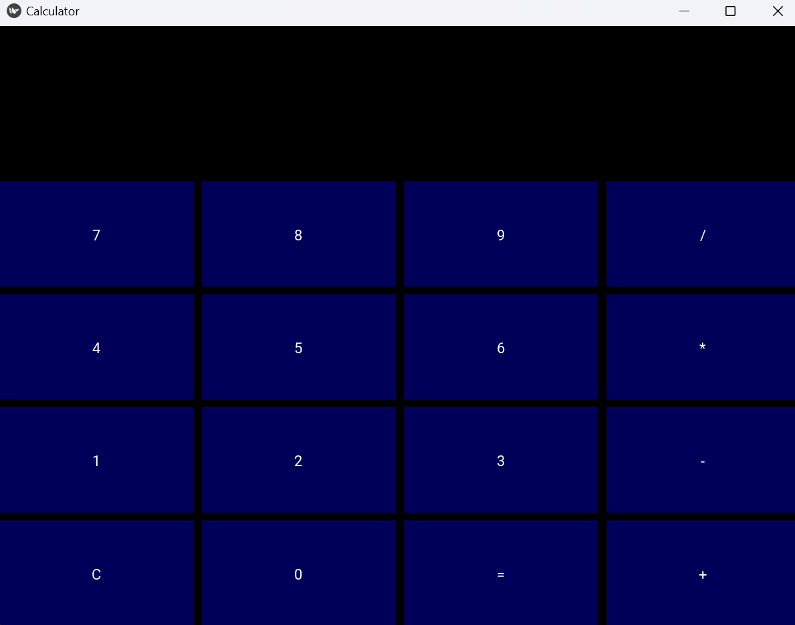

# Kivy Calculator App

This is a simple calculator application built using Kivy, a Python framework for developing multitouch applications.



## Features

- Arithmetic operations: addition (+), subtraction (-), multiplication (*), division (/)
- Clear button to reset the calculation
- Supports keyboard input for numbers and operations
- Error handling for invalid expressions

## Installation

1. Ensure you have Python installed. If not, you can download it from [python.org](https://www.python.org/).

2. Install Kivy. You can install it using pip:
``` bash
pip install kivy
```
 
3. Clone the repository:
```bash
git clone https://github.com/SyedAejazAhmed/Python_Mini_Project.git
```

4. Navigate into the project directory:
```bash
cd Calculator
```

## Usage

1. Run the calculator app:
```bash
python calculator.py
```

2. Use the mouse to click on the buttons or use the keyboard to input numbers and operations:
- Numbers: 0-9
- Operations: +, -, *, /
- Special keys: Enter (calculate), Esc (clear), Backspace (delete last character), Delete (clear all)

3. Enjoy calculating!

## Contributing
Contributions are welcome! If you find any issues or have suggestions for improvements, feel free to open an issue or create a pull request.

## License
This project is licensed under the MIT License - see the [LICENSE](LICENSE) file for details.
