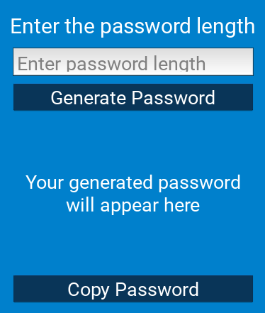

# Password Generator App
This is a simple password generator application built using Kivy framework in Python. It allows users to generate random passwords of varying lengths and copy them to clipboard.


## Features
-Generate random passwords using letters (both cases), digits, and special characters.
-Specify the length of the password.
-Copy generated password to clipboard with a click of a button.
-Responsive UI with clear instructions and feedback.

## Requirements
-Python 3.x
-Kivy (install via pip install kivy)

## Usage
1. Clone the repository:
```bash
git clone https://github.com/SyedAejazAhmed/Python_Mini_Project.git
```
2. Navigate into the project directory:
```bash
cd Password_Generator
```

3. Install the dependencies (if not already installed):
```bash
pip install -r requirements.txt
```
4. Run the application:
```bash
python password.py
```

5. Enter the desired length for the password and click on "Generate Password" button or press Enter after entering the length.

6. Click on "Copy Password" to copy the generated password to clipboard.

## Screenshots


## Contributions
Contributions are welcome! If you find any issues or have suggestions, please feel free to open an issue or create a pull request.

##vLicense
This project is licensed under the MIT License - see the LICENSE file for details.
